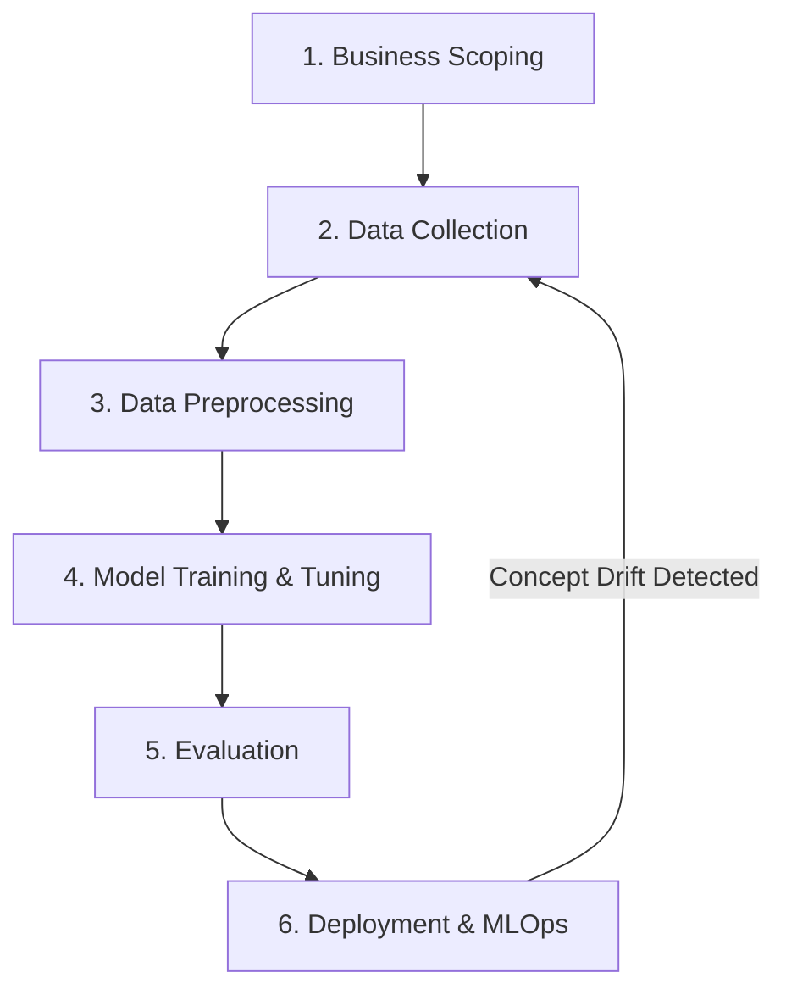

Before diving into complex mathematical optimization or deep architectures, you must understand the fundamental building blocks of the Machine Learning universe. How do we categorize algorithms, and what exactly does it mean when a computer "learns"?

---

## 1. The Three Paradigms of Machine Learning

Every ML algorithm falls into one of three distinct categories based on *how* it receives feedback.

### Supervised Learning
*   **What it is:** The algorithm is trained on data that contains both the inputs (`X`) and the correct answers or labels (`Y`). 
*   **When to use:** When you have a massive, historically labeled dataset (e.g., predicting if a tumor is malignant based on 10,000 doctor-labeled scans).
*   **Failure Case:** Data labeling is incredibly expensive. If your dataset lacks labels, Supervised Learning is mathematically impossible.

### Unsupervised Learning
*   **What it is:** The algorithm is given inputs (`X`) but absolutely no answers/labels. Its job is to find hidden structures or groupings in the chaos.
*   **When to use:** Customer segmentation, anomaly detection, and clustering.
*   **Why Not Supervised?** If you run an e-commerce store and want to find "groups of similar buyers", you don't actually know what the groups are beforehand. You cannot provide labels.

### Reinforcement Learning (RL)
*   **What it is:** An agent learns by interacting with an environment. It receives rewards for good actions and penalties for bad ones.
*   **When to use:** Robotics, self-driving cars, and game engines (AlphaGo).
*   **Why Not RL for everything?** RL requires an environment where millions of rapid simulations can be run. You cannot use RL to trade stocks reliably if your agent has to lose billions of real dollars to "learn" that buying a bankrupt company is a bad action.

| Feature | Supervised | Unsupervised | Reinforcement |
| :--- | :--- | :--- | :--- |
| **Data Required** | Features (`X`) + Labels (`Y`) | Features (`X`) only | State + Action + Reward |
| **Goal** | Predict a specific target | Discover hidden patterns | Maximize cumulative reward |
| **Example** | Spam Filtering | Customer Segmentation | Self-Driving Cars |

---

## 2. Anatomy of a Model: Weights and Loss

In software engineering, a function is a block of code you write. In Machine Learning, a **Model** is a mathematical function `f(X) = Y` that the computer writes.

### What are Weights?
Imagine a simple equation to predict house prices:
`Price = (W_1 * Bedrooms) + (W_2 * Square Footage)`

The numbers `W_1` and `W_2` are the **Weights** (or Parameters). "Training" a model is simply the process of the computer repeatedly guessing different numbers for `W_1` and `W_2` until it finds the combination that produces the most accurate predictions. A massive LLM like GPT-4 is just this exact concept scaled up to 1.7 trillion weights.

### What is a Loss Function?
How does the computer know if its current guess for `W_1` and `W_2` is good or bad? It calculates the **Loss**.
The Loss Function (or Cost Function) is a mathematical formula that calculates the difference between the model's prediction and the actual true label. 
*   **High Loss:** The model is predicting terribly.
*   **Zero Loss:** The model has perfectly predicted every single piece of data.

---

## 3. The AI Project Lifecycle

Freshers often assume AI Engineering is 100% modeling. In reality, modeling is a tiny fraction of the lifecycle.

1.  **Business Scoping:** Defining if ML is even necessary. (A SQL query might be better).
2.  **Data Collection:** Sourcing, scraping, or buying historical data.
3.  **Data Preprocessing:** Cleaning missing values, scaling, and encoding (covered in the next module).
4.  **Modeling:** Selecting an algorithm, training the weights, and tuning hyperparameters.
5.  **Evaluation:** Testing against a frozen Test Set to guarantee no data leakage occurred.
6.  **Deployment:** Wrapping the model in an API, deploying to a cloud server, and monitoring for statistical drift.

---

## 4. Production Perspective: The Scoping Trap

The most common mistake junior AI Engineers make is jumping straight to Step 4 (Modeling) without rigorous Step 1 (Scoping). 

If a stakeholder asks for an AI model to predict employee attrition, you must ask: *What is the baseline?* If the HR team currently predicts attrition with 60% accuracy using an Excel spreadsheet, your ML model must beat 60% while factoring in the cost of GPU compute, cloud hosting, and engineering salaries. If your complex neural network achieves 62% accuracy, the project is a failure. Always establish a naive baseline before training a model.

---

## 5. How This Appears in Modern AI Systems

These core foundations completely dictate how modern GenAI systems are built:
*   **Supervised Learning:** The final step of training ChatGPT is **RLHF** (Reinforcement Learning from Human Feedback) combined with Supervised Fine-Tuning (SFT), where human annotators write the exact "Labels" (ideal responses) for the model to mimic.
*   **Unsupervised Learning:** The core initial training of an LLM is purely unsupervised. It reads billions of web pages and learns the hidden structures of grammar without any human labeling.
*   **Loss Functions:** A trillion-parameter model is still just mathematically calculating a Loss Function (like Cross-Entropy Loss) across millions of GPUs to update its weights.

---

## 6. Interview Mastery: Question Bank

### Beginner
1. What is the difference between Supervised and Unsupervised learning?
2. Define a "Feature" and a "Label" in Machine Learning.
3. What is a "Weight" or "Parameter" in a model?
4. What is the purpose of a Loss Function?
5. List the 6 steps of the AI Project Lifecycle.

### Intermediate
6. If you want to group your user base into 5 distinct marketing tiers but have no historical data on who belongs to what tier, which ML paradigm do you use?
7. Explain why Reinforcement Learning is rarely used for standard tabular data problems like predicting loan defaults.
8. *Why Not:* Why wouldn't you use Unsupervised Learning to predict next month's sales revenue?
9. Explain what a "Naive Baseline" is and why it's critical in the Business Scoping phase.
10. In the equation `Y = WX + B`, what is `B`, and why is it mathematically necessary?

### Advanced
11. If your Loss Function is calculating a value of `0.00`, is your model perfect, or is there a systemic problem? Explain.
12. How does the choice of Loss Function differ when predicting a continuous number (like price) versus a category (like spam/not spam)?
13. Describe a scenario where the cost of a False Positive is so high that you would intentionally deploy a model with lower overall accuracy just to minimize it.

### Project & Defense
14. *Scenario:* In your portfolio project, you framed the problem as a Supervised Learning task. Defend why this was the correct framing. What would have happened if you framed it as an Unsupervised task?
15. *Scenario:* Walk me through the exact Baseline you established for your last ML project. How much better did your model perform than a simple `if/else` heuristic?
