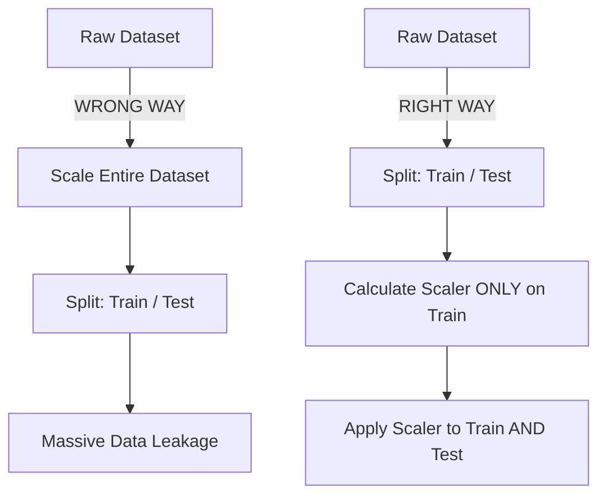

Real-world data is chaotic, incomplete, and fundamentally incompatible with mathematical algorithms. **Data Preprocessing** is the bridge that converts raw business reality into sterile mathematical tensors. 

If you feed garbage into a Neural Network, you will get highly confident garbage out. In fact, AI Engineers spend up to 80% of their time iterating on data pipelines rather than tuning model architectures.

---

## 1. Handling Missing Data (Imputation)

Datasets frequently have missing rows (`NaN` or `Null`). You cannot pass a `Null` value into a matrix multiplication. You must decide how to handle it.

### Strategy 1: Deletion
*   **What:** Drop the row or column entirely.
*   **When:** The missing data is completely random, and dropping it costs you less than 5% of your dataset.
*   **Why Not Deletion?** If you have 100 features and drop every row with at least one missing feature, you might accidentally delete 90% of your training data.

### Strategy 2: Statistical Imputation
*   **What:** Fill the missing value with a mathematical substitute.
*   **Mean Imputation:** Good for perfectly normal (bell curve) distributions.
*   **Median Imputation:** **(Recommended)** Extremely robust to outliers. If salaries are missing, imputing with the median prevents a billionaire from skewing your data.
*   **Mode Imputation:** Used strictly for categorical data (e.g., filling a missing "City" column with the most frequent city).

---

## 2. Encoding: Words to Numbers

Models only understand numbers. If your dataset has a column called `Color` with values like `Red`, `Green`, and `Blue`, you must encode it.

### Label Encoding vs. One-Hot Encoding

| Feature | Label Encoding | One-Hot Encoding |
| :--- | :--- | :--- |
| **How it works** | Assigns an integer to each category (Red=1, Green=2, Blue=3) | Creates a new binary column for *every* category. |
| **When to use** | **Ordinal Data:** When categories have a natural mathematical order (e.g., Low=1, Medium=2, High=3). | **Nominal Data:** When categories have no mathematical order (e.g., Colors, Cities). |
| **Failure Case (Why not Label?)** | If you Label Encode colors (Red=1, Blue=3), the neural network will incorrectly learn that "Blue is three times greater than Red". | Explodes the dimensionality of your dataset. If you have 10,000 unique cities, One-Hot Encoding adds 10,000 new columns (The Curse of Dimensionality). |

---

## 3. Feature Scaling

Imagine predicting house prices using two features: `Number of Bedrooms` (range: 1-5) and `Square Footage` (range: 500-5000). 

Because `Square Footage` has massive numbers, a Gradient Descent optimizer will become completely obsessed with it, adjusting weights wildly and completely ignoring the `Bedrooms` feature. We must scale both features to the same numerical range so the model treats them fairly.

### Min-Max Normalization vs. Standardization

1.  **Min-Max Scaling (Normalization):** Squeezes all values exactly into a `[0, 1]` range.
    *   *Tradeoff:* Highly sensitive to outliers. If one billionaire is in the dataset, everyone else's salary gets squashed down to `0.001`.
2.  **Standardization (Z-Score Scaling):** Shifts the distribution so the Mean is `0` and Standard Deviation is `1`. 
    *   *Tradeoff:* Does not bind values to a specific range (you can get values like `-3.2` or `4.1`), but it handles outliers beautifully and is the standard for Deep Learning and SVMs.

---

## 4. The Silent Killer: Data Leakage

**Data Leakage** is the most common reason a fresher fails an ML interview. It occurs when information from outside the training dataset (specifically, from the test set or the future) secretly "leaks" into the model during training.

The model will achieve 99.9% accuracy during testing, but the moment you deploy it to production, it will fail catastrophically.

### The Scaling Leakage Trap

**Why the "Wrong Way" leaks data:**
If you scale the *entire* dataset before splitting it, the mathematical Mean and Variance used to scale the training data were heavily influenced by the test data. The training set has secretly "seen" the future. 

**The Golden Rule of Preprocessing:** *Always `fit()` your preprocessing objects (Scalers, Imputers) strictly on the Training set. Then `transform()` the Validation and Test sets using those frozen parameters.*

---

## 5. Production Perspective

In an Applied AI context, preprocessing is not a Jupyter Notebook script—it is a live production pipeline.

If you deploy an ML model behind an API, the incoming JSON payload from the user must undergo the exact same preprocessing (imputing, encoding, scaling) as the training data, using the exact same saved parameters. 

**Pipeline Desynchronization** occurs when the Python script running in your production server processes data slightly differently than the Jupyter notebook used by the data scientist. To solve this, AI Engineers use libraries like `scikit-learn Pipelines` or `TFX` to serialize the model and the preprocessing steps as a single, inseparable artifact.

---

## 6. How This Appears in Modern AI Systems

Data preprocessing has scaled up massively in the GenAI era:
*   **LLM Pre-training Data:** OpenAI didn't just dump the internet into GPT-4. They spent months preprocessing data: removing duplicates, filtering toxic content, and normalizing text encoding (the modern equivalent of Imputation and Scaling).
*   **Embeddings:** When text is converted into vector embeddings for RAG, those embeddings are often normalized mathematically (using Cosine or L2 normalization) so that search algorithms can compare them quickly.
*   **Vision-Language Models:** When passing images into Claude or GPT-4o, the raw pixels are scaled down from `[0, 255]` to a `[-1, 1]` continuous distribution before the neural network processes them.

---

## 7. Interview Mastery: Question Bank

### Beginner
1. Why do we need to preprocess data? Can't neural networks learn around messy data?
2. What is the difference between Normalization and Standardization?
3. When should you use the Median instead of the Mean to fill missing values?
4. What is One-Hot Encoding?
5. Why is it dangerous to simply delete all rows with missing values?

### Intermediate
6. What is Data Leakage? Give a concrete example of how it happens.
7. Explain the "Dummy Variable Trap" in One-Hot Encoding. How do you avoid it?
8. *Why Not:* Why wouldn't you use Label Encoding for a "City" column?
9. *Why Not:* Why wouldn't you use Min-Max scaling on a dataset with extreme outliers?
10. How do you handle a categorical variable in your test set that was never seen in your training set?
11. Explain what happens to Gradient Descent if you don't scale your features.

### Advanced
12. If you are doing Time-Series forecasting, how does your Train/Test split differ from standard Random Splitting to avoid leakage?
13. How do you mathematically implement SMOTE for imbalanced datasets, and why is it better than simple duplication?
14. Walk me through exactly how you save a Scaler in a training script and load it in a production API.
15. If your production data distribution begins to drift (e.g., average income doubles), should you update your Scaler immediately? Why or why not?

### Project & Defense
16. *Scenario:* Your model gets 98% accuracy locally, but 40% in production. Walk me through how you would debug your preprocessing pipeline.
17. *Scenario:* In your portfolio project, you chose Standardization over Min-Max scaling. Defend that choice based on the algorithms you used.
18. *Scenario:* You are processing text embeddings for a RAG system. How does text chunking relate to traditional data preprocessing?
