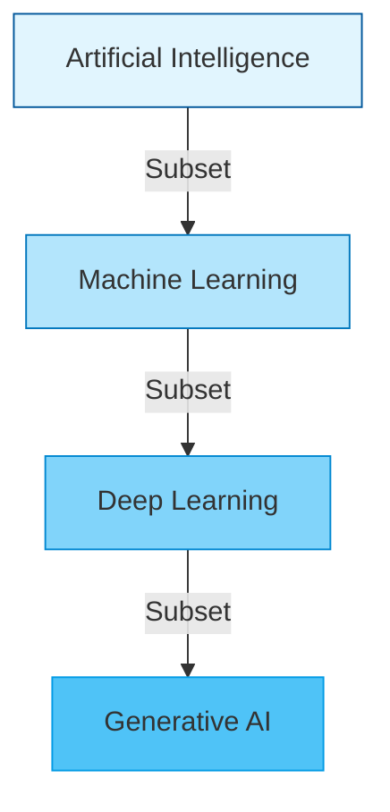

Welcome to the definitive, interview-focused guide to Machine Learning for AI Engineers. 

As an AI Engineer, it is tempting to skip the fundamentals and immediately start calling OpenAI's APIs. However, without a deep understanding of classical Machine Learning, you will be unable to debug systems, optimize costs, or pass technical interviews at top-tier companies.

---

## 1. The Paradigm Shift: Rules vs. Data

For decades, Software Engineering operated on a single paradigm: **Rule-Based Programming**.
You (the programmer) wrote the exact logic (`if/else` statements), fed in data, and the computer gave you the answers.

**Machine Learning flips this paradigm.** 
In Machine Learning, you give the computer the data AND the answers, and the algorithm mathematically deduces the rules.

### Why Not Just Write Standard Software?
Imagine writing a Python script to detect spam emails. You might write: `if "Viagra" in email or "Free Money" in email: return "Spam"`.
*   *The Failure Case:* Spammers will simply start writing "V!agra" or "Fr33 M0ney". You would have to write an infinite number of `if` statements to catch every variation. Standard software is too rigid for complex, noisy, real-world environments. ML models adapt to the statistical distribution of the noise.

---

## 2. The AI Ecosystem Hierarchy

It is crucial to understand the exact boundaries between AI, ML, DL, and GenAI. Interviewers frequently test if candidates conflate these terms.

### The Definitions
1.  **Artificial Intelligence (AI):** The broadest field. Any system mimicking human logic. Includes 1980s chess bots powered by pure `if/else` search trees (A* algorithms).
2.  **Machine Learning (ML):** Systems that learn patterns from data using statistical math (e.g., Logistic Regression, Random Forests).
3.  **Deep Learning (DL):** A subset of ML that uses massive, multi-layered Artificial Neural Networks to handle highly complex, unstructured data like images and audio.
4.  **Generative AI (GenAI):** A subset of DL specifically focused on models that *create new data* (text, images, audio) rather than just predicting or classifying existing data.

---

## 3. Production Perspective: Why Not Just Use LLMs for Everything?

A common fresher mistake is assuming Large Language Models (LLMs) make classical ML obsolete.

<Callout type="warning">
  **The Anti-Pattern:** Using GPT-4 to predict customer churn based on numerical spreadsheet data.
</Callout>

If your company wants to predict which users will cancel their subscription based on 20 numerical columns (age, login frequency, billing amount), an LLM is a terrible choice.

**The Tradeoffs:**
| Metric | Classical ML (e.g., XGBoost) | Generative AI (e.g., GPT-4) |
| :--- | :--- | :--- |
| **Latency** | ~2 milliseconds | ~2000+ milliseconds |
| **Cost** | Almost $0 per prediction | Extremely expensive at scale |
| **Explainability** | High (Feature Importance graphs) | Low (Black box hallucination risk) |
| **Data Type** | Structured (Tabular/SQL Data) | Unstructured (Text/Language) |

An elite AI Engineer knows *when* to use a scalpel (XGBoost) and when to use a sledgehammer (LLMs).

---

## 4. How This Appears in Modern AI Systems

The AI ecosystem hierarchy defines the architecture of modern companies:
*   **The GenAI Layer:** When you interact with ChatGPT, you are hitting a Generative Deep Learning model.
*   **The ML Layer:** But under the hood, OpenAI uses classical ML models to predict if your prompt violates their safety policy before it even reaches the LLM. 
*   **The AI Layer:** The broader system that routes your request, load balances the GPUs, and returns the response is the overarching "Artificial Intelligence" software.

---

## 5. Key Takeaways & Cheat Sheet

*   **ML** generates the rules; standard software requires you to write the rules.
*   **DL** is a specialized sub-branch of ML using Neural Networks.
*   **GenAI** is a specialized sub-branch of DL focused on content creation.
*   Never use a massive generative model for a task that a simple mathematical regression can solve faster, cheaper, and more accurately.

---

## 5. Interview Mastery: Question Bank

### Beginner
1. Explain the difference between Artificial Intelligence and Machine Learning.
2. If I write a Python script with 10,000 `if/else` statements to play chess, is it AI? Is it ML?
3. How does Machine Learning differ from traditional software engineering?
4. What is Deep Learning? How does it differ from classical ML?
5. Where does Generative AI fit into the AI ecosystem?

### Intermediate
6. Give an example of a problem that is easy for ML but almost impossible for traditional programming. Explain why.
7. *Why Not:* Why wouldn't you use an LLM to predict housing prices based on square footage and number of bedrooms?
8. What are the key tradeoffs between classical ML algorithms and Deep Learning models regarding compute cost?
9. Explain the difference between structured and unstructured data. Which type of ML is best for each?
10. If a company wants to classify 10 million tweets as positive or negative sentiment daily, would you recommend an LLM or a smaller classical NLP model? Defend your answer.

### Advanced
11. How does the "curse of dimensionality" affect classical ML models versus Deep Learning models?
12. Explain how an AI Engineer's role differs from a Machine Learning Researcher's role.
13. If your boss asks you to replace your entire classical ML recommendation system with a generative LLM, how do you mathematically argue against it?

### Project & Defense
14. *Scenario:* In your portfolio, you built a chatbot using RAG. Did that project utilize classical ML, Deep Learning, or both? Explain exactly where.
15. *Scenario:* Walk me through a time you decided *against* using a complex Deep Learning model in favor of a simpler solution. What drove that decision?
