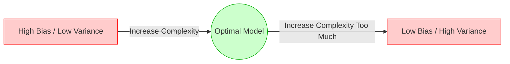

At its core, Machine Learning is an exercise in generalized pattern recognition. If a model only memorizes the exact data you show it, it is no better than a SQL database. The true test of an ML model is how accurately it performs on data it has **never seen before**. 

To achieve this, AI Engineers must navigate a series of mathematical tradeoffs.

---

## 1. The Core Tradeoff: Bias vs. Variance

Every time a model makes a prediction error, that error is composed of three parts: **Bias**, **Variance**, and **Irreducible Noise** (randomness in the universe you cannot fix). 

### What is Bias? (Underfitting)
Bias is the error introduced by approximating a highly complex real-world problem with a model that is too simple.
*   **High Bias** means the model is stubborn. It completely ignores the underlying patterns in the training data and just draws a straight line.
*   **Result:** **Underfitting.** The model performs terribly on the training data AND terribly on the test data.

### What is Variance? (Overfitting)
Variance is the error introduced when a model is *too* complex and overly sensitive to tiny fluctuations (noise) in the training data.
*   **High Variance** means the model acts like a student who memorizes the exact answers to a practice test but fails the actual exam because they didn't understand the underlying concepts.
*   **Result:** **Overfitting.** The model gets 99.9% accuracy on the training data, but fails catastrophically on the test data.

### The Sweet Spot

*Interview Defense:* You cannot have zero bias and zero variance. Decreasing one almost always increases the other. The goal of an AI Engineer is to find the exact point of complexity where the validation error is minimized before overfitting begins.

---

## 2. Model Validation: The Three-Way Split

To know if our model is generalizing, we must hide data from it.

<Callout type="warning">
  **Why Not Just Train and Test?**
  If you only use an 80/20 Train/Test split, you will train the model, test it, tweak hyperparameters, test it again, tweak again... Eventually, you will have accidentally "overfit to the test set" by manually adjusting the model until it scores well on that specific test data. 
</Callout>

To prevent this, we use a three-way split (e.g., 70% / 15% / 15%):
1.  **Training Set:** Used by the algorithm to calculate gradients and update weights.
2.  **Validation Set:** Used by the *Engineer* to tune hyperparameters and decide when to stop training (Early Stopping).
3.  **Test Set:** Locked away in a vault. Used exactly *once* at the very end of the project to report the final, unbiased accuracy to stakeholders.

### K-Fold Cross Validation
If your dataset is very small, a 15% validation set might only contain 100 rows, making your evaluation highly reliant on luck. **K-Fold Cross Validation** solves this by slicing the training data into `K` chunks (folds). It trains `K` separate models, using a different chunk as the validation set each time, and averages the scores.

---

## 3. Combating Overfitting: Regularization

If your model is overfitting (High Variance), you must constrain it. **Regularization** is the mathematical process of penalizing a model for being too complex.

### L1 (Lasso) vs. L2 (Ridge) Regularization

| Feature | L1 Regularization (Lasso) | L2 Regularization (Ridge) |
| :--- | :--- | :--- |
| **How it penalizes** | Adds the absolute value of the weights to the loss function. | Adds the squared value of the weights to the loss function. |
| **Effect on Weights** | Pushes less important feature weights to exactly zero. | Pushes weights close to zero, but never exactly zero. |
| **Primary Use Case** | **Feature Selection.** Excellent when you have 10,000 features and want to find the 50 that actually matter. | **Weight Distribution.** Excellent for handling highly correlated features and general overfitting. |

---

## 4. Hyperparameter Tuning

Parameters (like Neural Network weights) are learned automatically during training. **Hyperparameters** (like Learning Rate, Depth of a Tree, or number of K-Folds) must be set by the Engineer *before* training begins.

*   **Grid Search:** Tests every single possible combination of hyperparameters. Guaranteed to find the best configuration in your grid, but computationally impossible for large models.
*   **Random Search:** Randomly samples combinations. Mathematically proven to find a near-optimal configuration in a fraction of the time of Grid Search.
*   **Why Not Grid Search?** If you have 5 hyperparameters, each with 10 possible values, Grid Search requires training 100,000 separate models.

---

## 5. Production Perspective: The Moving Target

In a university course, the test set is static. In production, the "test set" is the stream of live user data hitting your API tomorrow, and it is constantly changing.

Because real-world data drifts, a model that perfectly balanced Bias and Variance on deployment day will slowly slide into underperformance. Production AI Systems require automated **Champion/Challenger (A/B) testing architectures**, where a new model is continually trained in the background and silently evaluated against the live model to see if it generalizes better to recent data.

---

## 6. How This Appears in Modern AI Systems

The fundamental tradeoffs of ML dictate the architecture of modern AI:
*   **LLM Fine-Tuning (Overfitting):** If you fine-tune Llama-3 on 100 examples of your company's support tickets, it will quickly overfit (memorize the tickets). When a real user asks a slightly different question, the model will hallucinate wildly (High Variance).
*   **LoRA / QLoRA (Regularization):** Modern parameter-efficient fine-tuning techniques (like LoRA) act as extreme forms of regularization. By freezing the base model and only training a tiny adapter, it physically prevents the LLM from overfitting to small datasets.
*   **Early Stopping:** When training a custom embedding model for your RAG system, your MLOps pipeline will monitor the validation loss and automatically halt training the moment the validation loss spikes up, ensuring optimal generalization.

---

## 7. Interview Mastery: Question Bank

### Beginner
1. Explain the Bias-Variance tradeoff to a 5-year-old.
2. How do you know if your model is Overfitting?
3. How do you know if your model is Underfitting?
4. What is the difference between a Parameter and a Hyperparameter?
5. Why do we need a Validation set? Why isn't a Test set enough?

### Intermediate
6. What is K-Fold Cross Validation, and when should you use it?
7. Explain the mathematical difference between L1 and L2 Regularization.
8. *Why Not:* Why wouldn't you use L1 Regularization on a dataset where all features are equally important?
9. *Why Not:* Why is Grid Search rarely used in Deep Learning?
10. If your model is Underfitting, what specific steps would you take to fix it? (List 3)
11. If your model is Overfitting, what specific steps would you take to fix it? (List 3)

### Advanced
12. How does the size of your training data affect Bias and Variance?
13. Can a model have both High Bias and High Variance at the same time? How?
14. Explain how "Early Stopping" acts as a form of Regularization in Neural Networks.
15. If you apply L2 Regularization to a Linear Regression model, how does it handle highly correlated multicollinear features?

### Project & Defense
16. *Scenario:* Your training loss is 0.01, but your validation loss is 1.5. What is happening, and what is the exact next line of code you write to fix it?
17. *Scenario:* Defend your choice of using Random Search instead of Grid Search for hyperparameter tuning in your last project.
18. *Scenario:* Explain how you ensured your model wasn't just "memorizing" the training data when you built your portfolio project.
