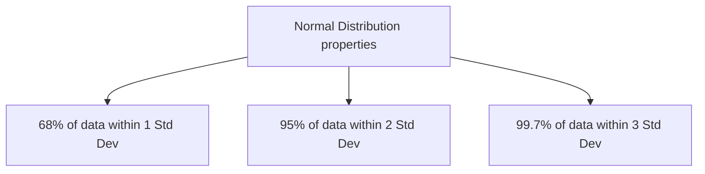

Statistics is not just theoretical math for academic researchers. For an AI Engineer, statistics is the lens through which you understand data quality, model confidence, and production drift. Without statistical intuition, you are blindly passing arrays into API endpoints.

## 1. Central Tendency & Dispersion: The Basics

When analyzing a massive dataset, you cannot look at every row. You must compress the dataset into summary metrics.

### Mean vs. Median vs. Mode

*   **Mean (μ):** The mathematical average. Highly sensitive to outliers.
*   **Median:** The exact middle value when sorted. Extremely robust to outliers.
*   **Mode:** The most frequent value. Used primarily for categorical data.

<Callout type="warning">
  **Why Not Just Use the Mean? (The Outlier Problem)**
  Imagine predicting house prices. A neighborhood has 99 houses worth $100k, and 1 mansion worth $50M. The **mean** house price is roughly $600k. If your model predicts $600k for the next house, it will be catastrophically wrong 99% of the time. The **median** ($100k) is the true representative value.
</Callout>

### Variance and Standard Deviation

Variance (`σ²`) measures how far a set of numbers is spread out from their average value. Standard Deviation (`σ`) is simply the square root of the variance, bringing the unit back to the original scale.

**High Variance** means the data is widely spread out (unpredictable). **Low Variance** means the data is tightly clustered around the mean (predictable).

## 2. Probability & Distributions

Machine Learning is fundamentally about predicting the *probability* of an outcome given some data.

### The Normal (Gaussian) Distribution

The Normal Distribution is the most important concept in statistics. It forms the famous "bell curve".

Why do we care? Because many ML algorithms (like Linear Regression and Gaussian Naive Bayes) mathematically *assume* that your data follows a normal distribution. If you feed them heavily skewed data, they will fail.

### Conditional Probability & Bayes' Theorem

**Conditional Probability** `P(A|B)` is the probability of event `A` occurring *given that* event `B` has already occurred.

**Bayes' Theorem** allows us to update our beliefs based on new evidence. It is the mathematical foundation for Generative AI and LLMs (predicting the next word *given* the previous context).

`P(A|B) = (P(B|A) * P(A)) / P(B)`

*   **`P(A)` (Prior):** What we believed before seeing evidence.
*   **`P(B|A)` (Likelihood):** How likely the evidence is, if our belief is true.
*   **`P(A|B)` (Posterior):** Our updated belief after seeing the evidence.

<Callout type="info">
  **Real-World Example: Spam Filtering**
  `P(Spam | "Free Money")` = The probability an email is spam *given* it contains the words "Free Money". Bayes theorem calculates this by looking at how often "Free Money" appears in known spam vs known normal emails.
</Callout>

## 3. The Central Limit Theorem (CLT)

The CLT states that if you take sufficiently large random samples from *any* population (regardless of its underlying distribution), the distribution of the sample means will approximate a Normal Distribution.

**Why AI Engineers Care:** You rarely have the entire population of data. You only have a sample. The CLT allows us to make confident mathematical predictions about the whole population using only our training sample, assuming the sample is large enough.

---

## 4. Production Perspective: Concept Drift

In production, models degrade over time. This is almost always a statistical failure known as **Data Drift** or **Concept Drift**.

*   **Data Drift:** The statistical distribution of the input features `P(X)` changes. (e.g., You trained a fraud model in 2019, but in 2024, purchasing behavior has completely shifted due to mobile wallets).
*   **Concept Drift:** The relationship between the input and the target `P(Y|X)` changes. (e.g., A macroeconomic crash changes what a "good credit score" actually means).

AI Engineers use statistical tests (like the Kolmogorov-Smirnov test) in their MLOps pipelines to constantly compare the distribution of live production data against the original training data. If the distributions diverge, an alert is triggered to retrain the model.

---

## 5. Summary & Cheat Sheet

| Concept | What it is | AI Engineering Use Case |
| :--- | :--- | :--- |
| **Median** | 50th percentile value | Imputing missing data safely without outlier skew. |
| **Standard Deviation** | Spread of data | Identifying anomalies or outliers (`> 3σ`). |
| **Bayes Theorem** | Updating probabilities | Naive Bayes classifiers, foundational NLP logic. |
| **Normal Distribution** | Bell curve | Assumption for linear models and scaling techniques. |
| **Kolmogorov-Smirnov** | Distribution comparison test | Detecting Data Drift in production monitoring systems. |

---

## 5. How This Appears in Modern AI Systems

Statistics is the unseen backbone of every modern AI pipeline:
*   **Model Evaluation:** Every time you benchmark an LLM on MMLU or HumanEval, you are calculating statistical significance to prove the new model is actually better, not just lucky.
*   **Drift Detection:** In MLOps, Kolmogorov-Smirnov tests run automatically every hour to compare the live data distribution against the training data distribution.
*   **A/B Testing:** When deploying a new recommendation system, standard deviations and p-values determine if the new algorithm actually increased user engagement.

---

## 6. Interview Mastery: Question Bank

### Beginner
1. What is the difference between Mean and Median? When would you use each?
2. Define Variance and Standard Deviation in simple terms.
3. What is a Normal Distribution?
4. What is the 68-95-99.7 rule?
5. What is the difference between Probability and Statistics?
6. Explain what an Outlier is and how it affects the mean.
7. What is Conditional Probability?

### Intermediate
8. Explain Bayes' Theorem to a non-technical person.
9. What happens if you apply an algorithm assuming normal distribution to highly skewed data?
10. How does the Central Limit Theorem apply to Machine Learning?
11. If two variables are highly correlated, does one cause the other? Why or why not?
12. What is the difference between Covariance and Correlation?
13. How do you handle missing values statistically without dropping the rows?
14. Explain what a Long-Tail distribution is and why it's problematic for ML.

### Advanced
15. What is Data Drift vs Concept Drift? How do you detect them statistically?
16. How does the Kolmogorov-Smirnov test work in the context of model monitoring?
17. Explain the mathematical relationship between Bayes Theorem and Maximum Likelihood Estimation (MLE).
18. If your dataset has a multimodal distribution, what preprocessing steps might you take before feeding it to a linear model?

### Project & Defense
19. *Scenario:* In your last project, how did you verify the statistical integrity of your dataset before training?
20. *Scenario:* Your production model's accuracy dropped by 15% overnight. Walk me through the statistical checks you would run to diagnose the issue.
21. *Scenario:* You chose to fill missing age values with the median instead of the mean. Defend this choice.
